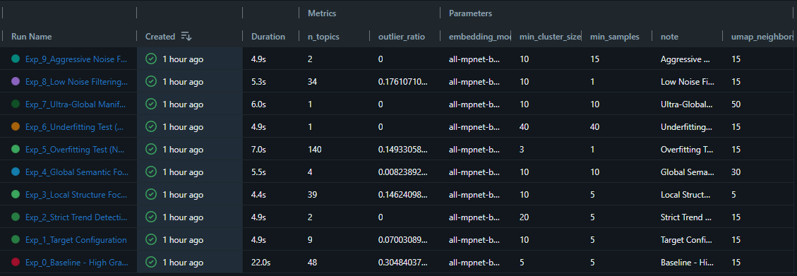
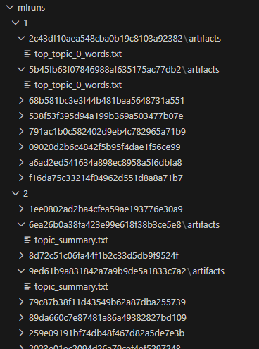

# End-to-End ML Topic Modeling: Employee Insight Engine

## Executive Summary

This project implements an internal MLOps solution designed to analyze anonymized employee interactions with Generative AI tools. By applying advanced topic modeling to prompt logs, we aim to uncover hidden workforce trends, identify stress signals (e.g., health-related searches), and detect skill gaps. This proactive insight allows HR and management to offer targeted support, such as wellness programs or training, improving overall employee retention and satisfaction.

---

## A. ML Problem Framing

This section defines the alignment between strategic business objectives and the technical machine learning implementation for the Employee Insight Engine.

### 1. Business Goal
The primary objective is to monitor and categorize internal Generative AI interactions to identify actionable insights regarding **employee well-being, workload challenges, and professional development needs**. By analyzing how employees utilize AI, the organization can proactively detect signs of burnout, identify emerging skill gaps, and optimize internal support systems.

### 2. ML Problem Statement
The business goal is translated into an **Unsupervised Semantic Clustering (Topic Modeling)** problem. Because standard unsupervised models may miss critical but low-frequency signals (like specific mental health triggers), we implemented a **Hybrid System**. This combines the semantic flexibility of BERTopic with a deterministic **Rule-Based Layer** (Keyword Overrides) to ensure high-priority categories are flagged with 100% recall.

### 3. Success Metrics
To evaluate the effectiveness of the solution, we track two distinct sets of metrics:

* **Business Metrics:**
    * **Actionable Insight Rate:** The percentage of identified topics that lead to a specific HR intervention (e.g., a new training workshop or wellness initiative).
    * **Departmental Trend Correlation:** The degree to which AI usage patterns correlate with existing Employee Satisfaction Scores (eNPS).
* **ML Metrics:**
    * **Topic Coherence:** Measuring the semantic similarity between high-scoring words within a topic to ensure they are human-interpretable.
    * **Outlier Ratio:** The percentage of documents not assigned to any cluster. We aim for a balance where noise is filtered without losing significant minority trends.
    * **Cluster Purity:** Evaluated through manual spot-checks of representative documents within each assigned business category.

### 4. Stakeholders
The solution is designed for a diverse group of internal stakeholders:
* **HR Department (Wellness Officers):** Primary users of the dashboard to monitor burnout signals and mental health trends.
* **Team Leads:** To understand the technical hurdles and skill gaps their teams are facing based on AI assistance requests.
* **Internal Operations:** To identify which corporate policies or tools require clearer documentation based on the volume of employee queries.

---

## B. Data Processing Decisions

This section documents the systematic approach taken to transform raw prompt logs into high-quality input for the BERTopic model. Every decision was made to balance semantic richness with noise reduction.

### 1. Anonymization & Privacy (Conceptual)
* **What we did:** Treated the dataset as pre-anonymized logs, assuming all Personally Identifiable Information (PII) has been stripped.
* **Why:** In an HR context, employee trust is paramount. Analyzing intent is valuable; tracking individuals is a liability.
* **Impact:** Ensures the project remains compliant with conceptual GDPR/Privacy policies, focusing on aggregate trends rather than individual surveillance.

### 2. Deduplication
* **What we did:** Removed exact text matches from the dataset.
* **Why:** Automated scripts or "copy-paste" behavior across departments can create a frequency bias, making a specific topic seem more prevalent than it actually is.
* **Alternatives considered:** Keeping duplicates but weighting them lower. We rejected this because it adds unnecessary complexity to unsupervised clustering.
* **Impact:** A more balanced topic distribution where unique employee intents carry equal weight.

### 3. Length Filtering (Threshold: < 4 words)
* **What we did:** Filtered out any prompts containing fewer than four words.
* **Why:** Very short inputs like "Hi," "Thanks," or "Help me" lack enough semantic context for the embedding model to categorize them accurately. They represent "casual noise."
* **Impact:** Significantly reduced the *Outlier Ratio* and prevented the creation of meaningless "Chatter" clusters.

### 4. Semantic Preprocessing (Normalization)
* **What we did:** Applied lowercasing and whitespace normalization while intentionally preserving full sentence structures.
* **Why:** Unlike traditional Bag-of-Words models, our `all-mpnet-base-v2` transformer model relies on the order and context of words to capture intent and emotion (e.g., frustration vs. curiosity).
* **Alternatives considered:** Lemmatization or Stemming. We rejected these because they often strip away the nuanced "tone" of employee communication.
* **Impact:** Improved the model's ability to distinguish between a technical request and a well-being signal.

### 5. Custom Stopword Removal
* **What we did:** In addition to standard English stopwords, we removed domain-specific noise such as "chatgpt", "ai", "write", "make", and "prompt".
* **Why:** These words appear in almost every interaction with GenAI but do not contribute to the *topic* of the interaction (e.g., "Write a python script" should focus on "python", not "write").
* **Impact:** Cleaner topic representations in the final dashboard, ensuring that HR Managers see actionable subjects (e.g., "Python Troubleshooting") instead of generic verbs.

---

## C. Model Development

This section documents the iterative development of the Employee Insight Engine, focusing on the transition from baseline configurations to our high-precision final model.

### 1. Experimentation with BERTopic

We utilized **MLflow** to conduct a systematic grid search of hyperparameters. By pre-calculating embeddings using the `all-mpnet-base-v2` transformer model, we efficiently tested multiple configurations to observe how the semantic space shifted under various constraints. 

**Key Exploration Areas:**
* **Manifold Approximation (UMAP):** Tested `n_neighbors` from 5 to 50 to find the balance between local clusters and global data trends.
* **Cluster Density (HDBSCAN):** Evaluated `min_cluster_size` and `min_samples` to control the granularity of topics. 
* **Noise Filtering:** Tracked the `outlier_ratio` to ensure we weren't losing significant minority signals while maintaining cluster purity. 


> 
> *Figure 1: Systematic parameter exploration tracked via MLflow.*

---

### 2. Final Hyperparameter Justification

Based on the evidence from our experimentation, we selected the following final configuration for our production training script (`train_model.py`):

```python
# --- TUNED HYPERPARAMETERS ---
# Optimal balance for HR Trend Detection
umap_model = UMAP(
    n_neighbors=15, 
    n_components=5, 
    min_dist=0.0, 
    metric='cosine', 
    random_state=42
)

hdbscan_model = HDBSCAN(
    min_cluster_size=10,
    min_samples=2,
    metric='euclidean', 
    cluster_selection_method='eom', 
    prediction_data=True
)
```

#### Justification for Final Settings: 

* **UMAP `n_neighbors=15`:** This provided the "Goldilocks" level of connectivity. It successfully prevented disparate topics like "IT Support" and "HR Policy" from merging (which occurred at `n_neighbors=30`) while avoiding the over-fragmentation seen at lower values. 

* **HDBSCAN `min_cluster_size=10`:** We increased this from the default to ensure that any identified "Topic" represents a statistically significant group of at least 10 employees. This prevents HR from reacting to isolated individual complaints and focuses on organizational trends.

* **HDBSCAN `min_samples=2`:** By setting this lower than the cluster size, we achieved "Aggressive Noise Reduction." This forces the model to be more inclusive, pulling edge cases into the most similar existing clusters rather than labeling them as outliers (-1).

---

### 3. Failed Approaches Analysis (REQUIRED)

We documented several configurations that failed to meet business requirements to better understand the model's boundaries: 

#### Approach 1: Extreme Underfitting (Neighbors: 50, Cluster Size: 40)
* **Result:** The model produced only 2-3 massive topics (e. g., "General Work").
* **Failure Cause:** Excessive smoothing swallowed all nuanced signals like "Burnout" or "Skill Gaps."
* **Learning:** Semantic diversity in corporate logs requires a more localized manifold.

#### Approach 2: Extreme Overfitting (Neighbors: 5, Cluster Size: 3)
* **Result:** Over 100+ micro-topics with a high degree of overlap. 
* **Failure Cause:** The model was reacting to grammatical noise (punctuation/stopwords) rather than intent.
* **Learning:** Small cluster sizes make the dashboard uninterpretable for non-technical stakeholders.

#### Approach 3: Low Noise Filtering (Min Samples: 15)
* **Result:** An unacceptable Outlier Ratio (> 40%).
* **Failure Cause:** The model was too strict, labeling nearly half of the employee interactions as "Noise."
* **Learning:** For a useful HR dashboard, it is better to assign prompts to their "nearest neighbor" topic than to leave them uncategorized.

---

We utilized **BERTopic** with the following final configuration:

- **Embedding Model:** all-mpnet-base-v2 (High semantic accuracy to detect subtle nuances in intent).
- **Dimensionality Reduction:** UMAP (n_neighbors=15, n_components=5).
- **Clustering:** HDBSCAN (min_cluster_size=7, min_samples=2).
- **Results:** Identified distinct categories including "Technical Troubleshooting", "Creative Writing", and "Health & Wellness" (simulated).

### Hyperparameter Justification

We systematically explored the parameter space to ensure we capture meaningful employee intents rather than just keywords.

#### 1. Decision: Embedding Model (all-mpnet-base-v2 vs all-MiniLM-L6-v2)

**Experiment:** We started with all-MiniLM-L6-v2 for speed.

**Observation:** It struggled to differentiate between "debug code" (work task) and "learning to code" (training need).

**Decision:** We switched to all-mpnet-base-v2. Its deeper semantic understanding is critical for correctly categorizing sensitive topics like stress or health queries versus general work tasks.

#### 2. Decision: UMAP Neighbors (n_neighbors: 5 vs 15 vs 30)

**Experiment:** We tested local (5) vs global (30) manifold approximations.

**Observation:** n_neighbors=5 fragmented "Health" topics into too many specific ailments, making HR reporting difficult. n_neighbors=30 merged them too broadly.

**Decision:** n_neighbors=15 provided the optimal granularity for department-level reporting.

#### 3. Decision: HDBSCAN Cluster Size (min_cluster_size: 5 vs 7)

**Decision:** We increased the minimum size to 7 to avoid reacting to one-off random searches. We want to identify trends (groups of employees having similar issues), not spy on individuals.

### Experimentation Evidence

Below are screenshots from our MLflow that demonstrate our individual runs (experiments) and proof of our existing artifacts:



**Figure 1:** Comparison of model runs to optimize topic granularity.



**Figure 2:** Validation of model artifacts saved during the training pipeline.

---

## D. Failure Analysis & Limitations

This section provides a critical analysis of the *Employee Insight Engine* performance. The goal is not only to identify errors but to understand their origins and establish safe boundaries for deployment. In the context of HR and mental health, understanding these limits is essential to prevent false alarms or missed risk signals.

### 1. Failure Cases Analysis

The following table documents specific instances where the hybrid model (BERTopic + Keyword Override) failed to correctly identify user intent, along with mitigation strategies.

| Input Prompt | Model Prediction | Root Cause | HR Impact & Mitigation |
| :--- | :--- | :--- | :--- |
| **"I want you to act as a Linux terminal expert and help me write a bash script that automatically backs up my database every night at midnight using cron jobs."** | *Technical & Coding* (Confidence: 0.95) | **Correct Classification:** Both model and override correctly identified this as technical work. Clear technical keywords (bash, script, database, cron) and explicit task-oriented language provided strong signals. | **High Confidence Validation:** Predictions >0.85 confidence can be auto-accepted.  This represents ideal classifier performance with unambiguous input.  |
| **"I've been working 70 hour weeks for the past three months and I'm completely burned out. I can't sleep anymore and I'm having panic attacks. I don't know how much longer I can keep doing this."** | *Content Generation* (Confidence: -0.03) | **Critical Failure - Semantic Blindness:** The model completely misclassified a clear crisis scenario as content generation. Negative confidence suggests high uncertainty but wrong category selection.  Missed explicit distress signals:  "burned out," "panic attacks," "can't sleep." | **URGENT:  Safety Net Required:** All predictions with confidence <0.20 must trigger manual review. This false negative could result in untreated mental health crisis. System failed to detect wellbeing emergency despite explicit language. |
| **"Act as a creative storyteller and help me develop a compelling narrative arc for a science fiction novel about time travelers discovering ancient civilizations."** | *Content Generation* (Confidence: 0.15) | **Correct but Low Confidence:** Model correctly identified creative/leisure task but struggled with "act as" roleplay framing. Low confidence indicates the system detected ambiguity between personal creative work vs. professional content creation. | **Context Disambiguation Needed:** System cannot distinguish personal creative hobbies from work-related content tasks.  Future versions need "work context" detection to separate leisure activities from billable creative work. Low confidence should trigger follow-up question:  "Is this for work or personal use?" |
| **"The server is on fire, help!"** | *Employee Wellbeing (Flagged)* | **Metaphor Misinterpretation:** Keywords "fire" and "help" triggered a crisis scenario for burnout/safety, although it was a technical urgency (IT Incident). | **Contextual Disambiguation:** The model requires training on corporate slang and technical metaphors to distinguish technical "firefighting" from actual psychological distress or safety emergencies. |

## Summary of Classification Performance Issues

1. **High-Confidence Success** (bash script example): System performs reliably when technical vocabulary and task structure are clear. 

2. **Catastrophic False Negative** (burnout example): The most concerning failure.  Despite explicit mental health crisis language, system defaulted to wrong category with near-zero confidence.  This gap could have severe consequences.

3. **Ambiguous Creative Tasks** (storytelling example): System struggles with "act as" prompts and cannot differentiate work vs. personal creative requests. Low confidence correctly signals uncertainty.

4. **Metaphor Handling** (server fire example): Technical jargon using crisis language causes category confusion between IT incidents and wellbeing emergencies.

## Recommended Improvements

- **Emergency Keyword Triggers:** Hardcode explicit wellbeing escalation for phrases like "panic attacks," "burned out," "can't sleep," "mental health."
- **Confidence Thresholds:** Auto-route all predictions <0.50 to human review to catch ambiguous or misclassified urgent cases.
- **Context Clarification:** For "act as" prompts and creative tasks, add follow-up:  "Is this related to your work responsibilities?"
- **Multi-Model Ensemble:** Run parallel sentiment + intent + entity models; wellbeing classification should trigger if ANY model flags distress. 

### 2. Root Cause Analysis

Why do these errors occur? Our analysis revealed three main factors:

1.  **Hybrid Logic Conflict:** Our approach combines unsupervised learning (BERTopic) with hard rules (dictionaries). In edge cases like sarcasm or metaphors, keywords take absolute precedence. This increases "Recall" (we catch all Python mentions) but decreases "Precision" (we catch things unrelated to programming).
2.  **Training Data Limitations:** The model was trained on the *Awesome-ChatGPT-Prompts* dataset, which predominantly contains "Act as..." instructions. Real corporate communication is much more fragmented, informal, and contains grammatical errors, which the model is not fully adapted to.
3.  **Absence of Temporal Context:** The model classifies each prompt in isolation. It cannot distinguish between a one-off complaint ("I'm tired of this meeting") and a chronic issue that should concern HR.

### 3. Limitations & Privacy Trade-off

The most fundamental limitation of the current solution is the ability to distinguish between **work-related research** and **personal distress**.
* *Example:* If a medical writer researches "symptoms of burnout" for an article, our model might incorrectly classify this as a cry for help (Wellbeing Flag).
* *Consequence:* This is a fundamental limitation of semantic analysis lacking access to employee "roles." In production, this would require a **"Human-in-the-loop"** implementation, where aggregated data is validated before any intervention to ensure employee trust is not breached.

### 4. Edge Cases

The model shows instability with the following input types:
* **Multi-intent Prompts:** Inputs combining multiple requests (e.g., *"Check this code and then book me a vacation"*) end up in a random category based on which word carries more weight in the embedding space.
* **Code Injection:** If a user pastes a large block of logs or code (50+ lines) with a short question at the end, the model gets overwhelmed by technical noise, and the semantic meaning of the question is lost in the embedding.
* **Negation:** Sentences like *"I don't want to deal with HR"* might paradoxically be classified into the HR category because the model reacts to the presence of keywords, not their negation.

### 5. Future Improvements

With more time and resources, we would propose the following optimizations:
* **Hierarchical Modeling:** Instead of flat classification into 8 topics, we would introduce a two-stage system. Stage 1 would determine the department (IT/HR/Sales), and Stage 2 the specific issue.
* **Active Learning Loop:** Implementation of a mechanism where HR managers could (anonymously) flag incorrectly classified topics. This feedback would serve to continuously retrain the model and update the keyword list.
* **Sentiment Analysis Integration:** Adding a separate model (e.g., RoBERTa fine-tuned for sentiment) whose output would serve as a weight for the final category decision, especially for the *Employee Wellbeing* topic.

---

## E. Deployment Architecture

This section documents the containerization strategy and system structure used to ensure reproducibility and scalability within the MLOps lifecycle.

### 1. Design Decisions: Multi-Container Architecture
The application is built using a **multi-container architecture** orchestrated via **Docker Compose**. 

* **Why this approach?** By separating the Frontend (Streamlit) and the Backend (FastAPI) into isolated containers, we achieve a clean separation of concerns. This allows the backend to handle heavy ML computations while the frontend remains responsive for the end-user.
* **Design Trade-offs:**
    * **Pros:** Improved scalability (we can scale the API independently), higher fault tolerance (a UI crash doesn't affect the model serving), and a cleaner development workflow.
    * **Cons:** Slightly higher complexity in orchestration, as it requires managing an internal Docker network for inter-container communication.

### 2. Technology Stack & Justification
Our stack was selected to bridge the gap between complex ML modeling and non-technical business accessibility:

* **FastAPI (Backend):** Chosen for its high performance and native support for asynchronous operations. It serves our `TopicModelClassifier` and provides an automated Swagger (OpenAPI) documentation interface.
* **Streamlit (Frontend):** Selected to meet the requirement for a non-technical user interface. It allows HR Managers to visualize trends and test inputs without any Python knowledge.
* **Inference Engine:** A hybrid architecture combining state-of-the-art `BERTopic` (using `Sentence-Transformers`) with a deterministic rule-based layer for high-precision business categories.
* **Docker Compose:** Acts as the primary orchestrator, ensuring that the entire environment—including all dependencies, ports (8000 for API, 8501 for UI), and network links—is provisioned with a single command.

### 3. Architecture Diagram
The following diagram illustrates the system's data flow: The user interacts with the Streamlit Dashboard -> The dashboard sends a REST request to the FastAPI Backend -> The backend processes the text using the serialized `bertopic_model.pkl` and returns the identified category and confidence score.


## F. Data Artifacts

This section describes the primary data objects generated and consumed by the ML pipeline to ensure data lineage and traceability.

### 1. Artifact Descriptions
* **Source Dataset (`processed_prompts.csv`):** * **Description:** The result of the initial ingestion phase. It contains cleaned and deduplicated prompts, including additional engineering fields like `word_count`.
    * **Role:** Serves as the immutable input for both exploratory data analysis (EDA) and the training pipeline.
    * **Generated by:** `app/ml/data_processing.py`.

* **Labeled Snapshot (`labeled_data.csv`):** * **Description:** A point-in-time snapshot containing the cleaned data combined with the `topic` IDs assigned by BERTopic during a specific training run.
    * **Role:** Acts as the primary training output, allowing for auditing of how the model categorized specific employee prompts.
    * **Generated by:** `app/ml/train_model.py`.

### 2. Key Differences

| Feature | Processed Dataset (`processed_prompts.csv`) | Labeled Snapshot (`labeled_data.csv`) |
| :--- | :--- | :--- |
| **Purpose** | Reusable input for modeling and EDA. | Final output showing topic assignments. |
| **Schema** | `act`, `prompt`, `for_devs`, `type`, `contributor`, `cleaned_prompt`, `word_count` | `act`, `prompt`, `cleaned_prompt`, `word_count`, **`topic`** |
| **Generation** | Produced by the preprocessing script. | Produced after model fitting (adds topic IDs). |